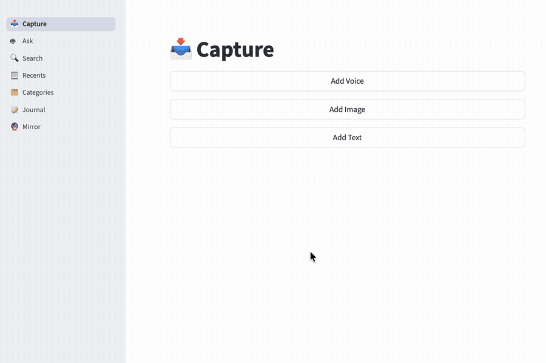
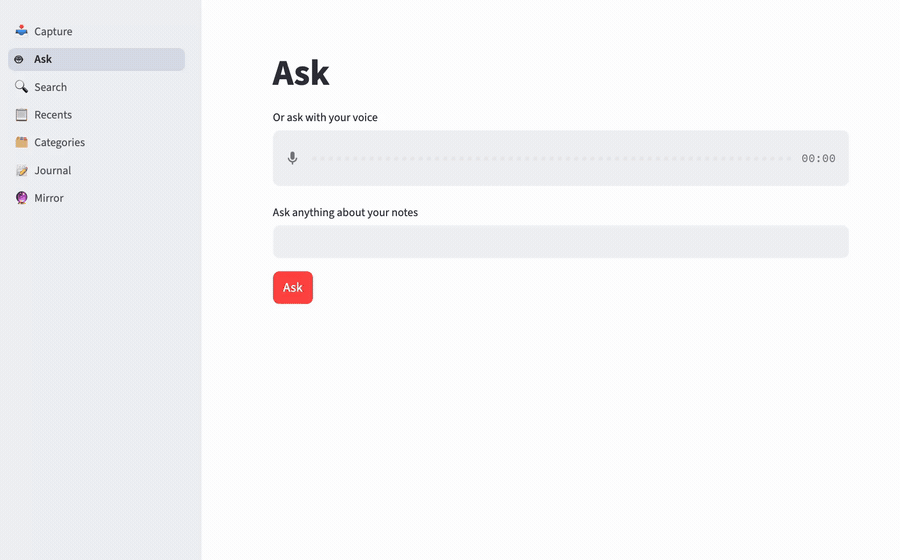
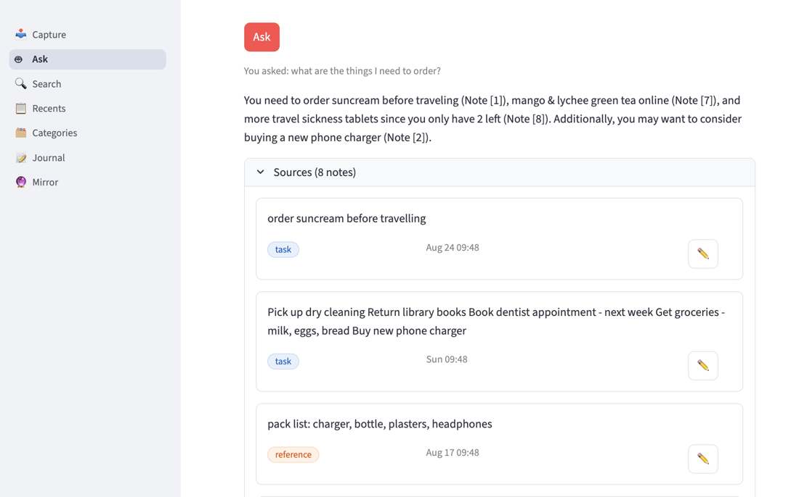
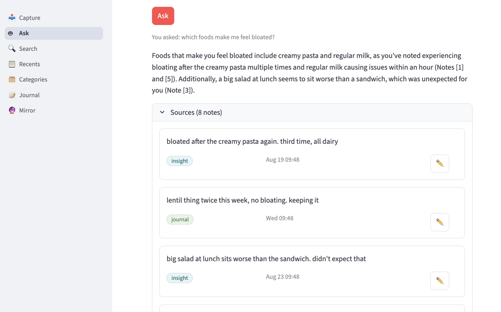

# Second Brain

**Second Brain** is a personal knowledge capture app: dump text, voice, or image notes with
zero friction, it auto-categorizes them and gives you semantic search plus grounded answers
over your own notes.

## Demo

Capture a note — no tagging, no filing; the category is assigned on save.



Then ask by voice, and get an answer grounded in your own notes, with the sources it used.



<details>
<summary>More Ask examples</summary>

<br>

Synthesizing across several notes, including items buried in a bulk errands list:



Pulling a pattern out of notes written weeks apart:



</details>

> Both clips run against the synthetic demo store, not real notes — see
> [Try it with sample data](#setup) below.

## Experiments & evaluation

The retrieval and RAG pipeline was built eval-first — two datasets (the second modeled on real
logged queries), a harness that grades retrieval, intent classification, and generation
independently, and RAGAS scoring with the LLM judges themselves audited at the claim level.

**Start here → [experiments/README.md](experiments/README.md)**

## Why

Built for my own ADHD-style note-taking: capture has to be instant or it doesn't happen at all.
The philosophy is **dump and mirror**: never organize at capture time; the app organizes for
you and reflects back what you've been thinking. It's in real daily use, which also supplies
the real usage data behind the evaluation work above.

## What it does

- **Capture** — text, voice (Whisper transcription), and image notes
- **Auto-categorize** — every note tagged on save (`task`, `mood`, `journal`, `learning`,
  `reference`, `insight`, `achievement`), LLM provider chain (OpenAI → Anthropic → Ollama)
  with manual override
- **Search** — semantic search over all notes, with date and type filters
- **Ask** — ask questions over your notes, get an answer grounded in them (retrieval + LLM)
- **Browse & Mirror** — recents, per-category views, and a weekly summary of what you've been
  thinking about

## How it works

Capture → Whisper/OCR → auto-categorize → store (**SQLite** as source of truth + **ChromaDB**
vectors) → find again (filtered semantic search, or Ask: intent analysis → retrieval →
grounded generation).

```
ui/            Streamlit pages & components — no business logic
src/           pure Python core — no Streamlit imports
  notes_service.py   save flow: categorize → store → audit log
  storage/           SQLite + ChromaDB
  rag/               Ask pipeline: analyzer → retrieval → generation
  processing.py      Whisper transcription
experiments/   eval datasets, harnesses, findings
```

## Setup

```bash
uv sync
cp .env.example .env   # OPENAI_API_KEY required (categorization, embeddings, Ask)
uv run streamlit run ui/app.py
```

Run tests with `uv run pytest`.

**Try it with sample data** — build a synthetic demo store (39 notes, no real data) and
point the app at it:

```bash
uv run python scripts/seed_demo.py
SECOND_BRAIN_DB=data/demo/entries.db SECOND_BRAIN_CHROMA=data/demo/chroma_data \
  uv run streamlit run ui/app.py
```

The `SECOND_BRAIN_*` vars are opt-in — without them the app uses your own store.

## Status

In daily personal use and actively evolving — not a polished public product. Design decisions
are logged as they're made, with revisit triggers ([docs/decisions.md](docs/decisions.md),
[experiments/docs/decisions.md](experiments/docs/decisions.md)). Current direction: topic/tag
organization and deployment.
